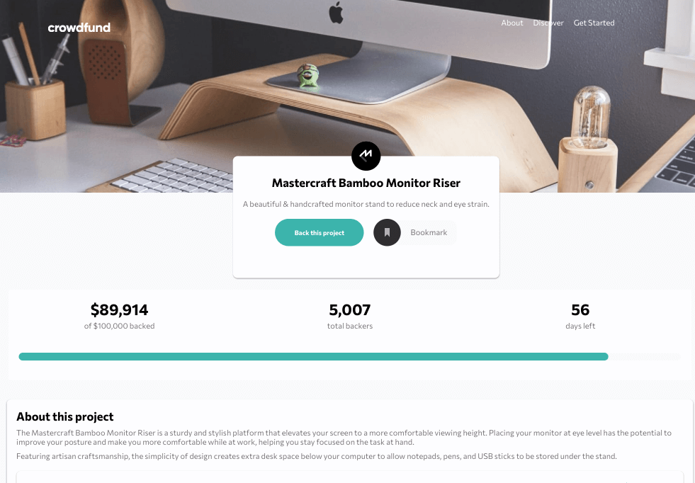
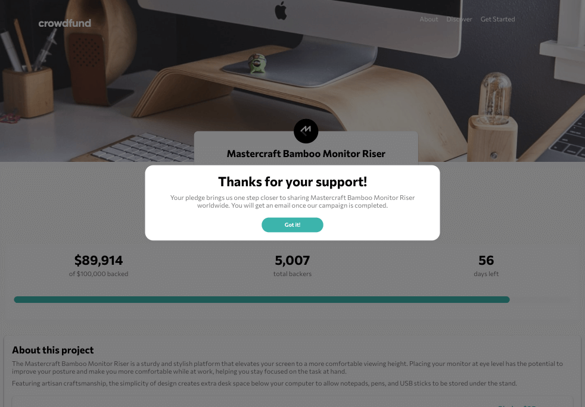
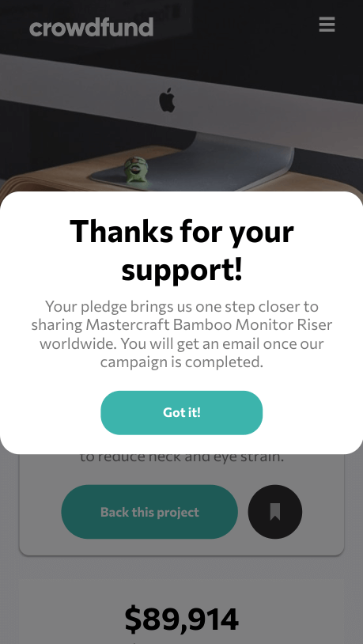
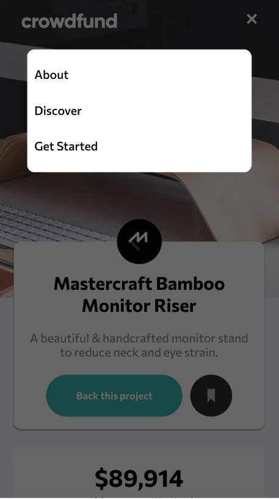

# Frontend Mentor - Crowdfunding product page solution

This is a solution to the [Crowdfunding product page challenge on Frontend Mentor](https://www.frontendmentor.io/challenges/crowdfunding-product-page-7uvcZe7ZR). Frontend Mentor challenges help you improve your coding skills by building realistic projects. 

## Table of contents

- [Overview](#overview)
  - [The challenge](#the-challenge)
  - [Screenshot](#screenshot)
  - [Links](#links)
- [My process](#my-process)
  - [Built with](#built-with)
  - [What I learned](#what-i-learned)
  - [Continued development](#continued-development)
  - [Useful resources](#useful-resources)

## Overview

### The challenge

Users should be able to:

- View the optimal layout depending on their device's screen size
- See hover states for interactive elements
- Make a selection of which pledge to make
- See an updated progress bar and total money raised based on their pledge total after confirming a pledge
- See the number of total backers increment by one after confirming a pledge
- Toggle whether or not the product is bookmarked

### Screenshot

### Links

- Live Site URL: [Github Pages](https://jdegand.github.io/crowdfunding-product-page/)

## My process

### Built with

- CSS custom properties
- Flexbox
- CSS Grid
- Mobile-first workflow

### What I learned

- You could set bookmarks at one point but it was abused and removed.  

### Continued development

- Semantic HTML5 markup
- Placeholder text should be lighter
- Things break if you don't complete the sequence of making a donation

### Useful resources

- [W3 Schools](https://www.w3schools.com/howto/howto_css_modals.asp) - Modal
- [Medium](https://medium.com/@nerdplusdog/a-how-to-guide-for-modal-boxes-with-javascript-html-and-css-6a49d063987e) - Modal
- [Sabe](https://sabe.io/tutorials/how-to-create-modal-popup-box) - Modal
- [Stack Overflow](https://stackoverflow.com/questions/24319505/how-can-one-display-images-side-by-side-in-a-github-readme-md)
